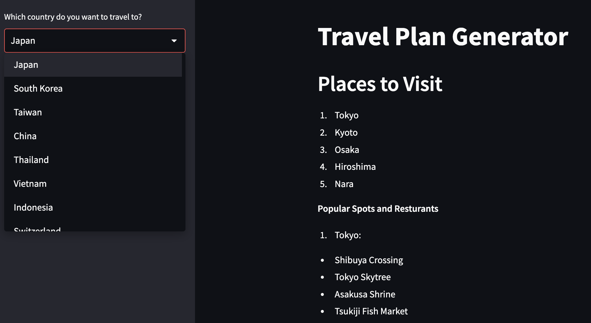

# 🌍 Travel Plan Generator

Welcome to the **Travel Plan Generator**! This project uses OpenAI's Large Language Models (LLMs) to create a dynamic travel planning application. By connecting to the OpenAI API using Langchain and building the web app with Streamlit, we aim to make travel planning fun and easy.

**Note** I selected 50 most visited tourist attraction countries (based on ChatGPT: GPT-4o) in my application 
**Note:** This project uses the `gpt-3.5-turbo` model.

## 🧠 What Are Large Language Models (LLMs)?
LLMs are advanced models based on supervised learning, pretrained on vast amounts of data. They excel in understanding and generating natural language, performing a wide range of tasks. [Learn more about LLMs](https://www.ibm.com/topics/large-language-models).

## 🤖 More About ChatGPT, OpenAI, and Langchain
You might already be familiar with ChatGPT, a web application that utilizes LLMs via OpenAI's API. However, since the knowledge of the `gpt-3.5-turbo` model is limited to data up until January 2022, we need a framework to connect to current external sources. That's where Langchain comes in!

## 🚀 How to Run This Project
Follow these steps to set up and run the Travel Plan Generator:

1. **Get an API Key from OpenAI:** Note that this might involve a small cost, but it's well worth it for the learning experience.
2. **Install Dependencies:** Run `pip install -r requirements_short_ver.txt` to install necessary packages.
    **Note:**  
        requirements_short_ver.txt: contains short version of requirement lists.
        requirements.txt: it contains more lists in case you want to install it in new environment.
3. **Experiment in Jupyter Notebook:** Use `Experimentation_travel_plan.ipynb` to test and ensure the code works step-by-step.
4. **Build the Web Application with Streamlit:**
   - **Langchain_code.py:** This file contains all the code from the experimentation phase.
   - **main.py:** This file contains the Streamlit code to generate the web application.
5. **Run the Application:** Type `streamlit run main.py` in your terminal to launch the app in your browser.

## 🙏 Acknowledgements
A huge shoutout to Dhaval Patel from Codebasics! His YouTube series on LangChain Tutorials has been invaluable in creating this application. Check out his [LangChain Tutorial Playlist](https://www.youtube.com/watch?v=nAmC7SoVLd8&list=PLeo1K3hjS3uu0N_0W6giDXzZIcB07Ng_F) for more in-depth learning. Highly recommended!

---

Feel free to reach out if you have any questions or need further assistance. Happy coding! 🚀